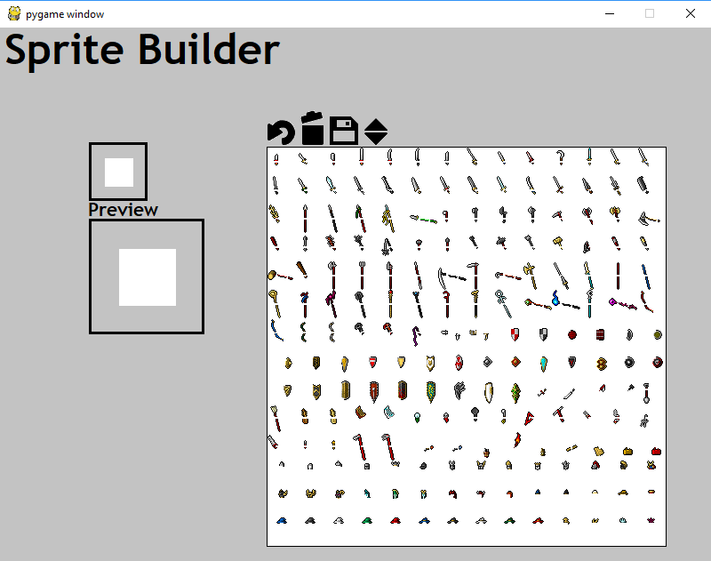

# Denzi Sprite Builder

**Note:  This is out of date and will be updated in the near future**

This is a little program I've written to parse and build 2d, non-animated character sprites from the Denzi pixel art
collection that can be obtained for free at [Open Game Art](https://opengameart.org/content/denzis-artwork)

View [credit](resources/images/CREDIT.TXT) and [license](resources/images/LICENSE.TXT) information.  These 
were provided along with the images at the link above and are being added to provide credit to the original author.

Dependencies
```
pygame
```

#### Usage

So how does this work?  It's pretty simple, make sure you have pygame 1.8+ installed, clone the repository and execute 
the `main.py`.

You'll be brought to this screen (provided the screen shot loads):



A master piece of UI design I know.  You'll noticed there are 4 main sections.

The First is the preview area.  There are two so you can better see what you're working on.  The smaller preview area
is a 32x32 pixel preview image.  The larger is a 64x64 zoomed in image.  Note that the images are only saved in 32x32
size and the 64x64 is simply a 2x scaled version.

Next is the Sprite List.  This is an interactive list of available sprites loaded from a json mapping file.  The mapping
file is explain in detail later.  Each sprite has a "tag" or "key" that is displayed above the list when a sprite is 
hovered over.  When a sprite is clicked, it is added as the top layer of the image.  This allows you to build a new 
image out of several other images.  The list is also scroll-able with the middle mouse wheel or with the up and down 
controllers above the list.

Last is the interactive image controls above the list.  The buttons are fairly self explanatory but for clarity we'll
cover them all.  First is the undo button, this allows you to take a step back.  This can be done multiple times
allowing you to revert an image back if needed.  The second is the clear or trash button.  This will delete the
image completely and leave you with a blank canvas to work with.  The third option is the save button.  This will
save the current image to the `data/saved_images/` directory with this format: `img_%timestamp%.png`.  Once the
image is saved, the canvas is cleared and ready for a new image to be made.  Finally, there are scroll controls
for the list.  You can move up and down the list as needed with these or (as mentioned above) you can use the
middle-mouse scroll wheel to move the list.

#### JSON Mapping Format

There are currently two variations of the JSON file.  V2 is what is currently implemented and is what I'd suggest
using as it is easier to work with in most cases.

The JSON object must be laid out in the following format:

```javascript
{
  "images": [
    {
      "key": "32x32_character_weapons_paperdoll_Denzi091016-2.png",
      "alpha": {"r":71,"g":108,"b":108},
      "map_sizes": {
        "sprite_size": 32,
        "block_size": 16
      },
      "map": [
        {"key": "tag", "x": 0, "y": 3},
        ...
      ]
    },
    ...
  ]
 }
```

`images` is the top level object name.  This can contain `N` number of files to load.

Each image object must contain the following information:
- `key` Defines the name of the file located in `resources/images` to load
- `alpha` Defines the RGB value of the "alpha" color. currently required, note that this needs to be in pygame's RGB 
(0-255) format and cannot currently handle color names or other formats
   - `r` Red channel
   - `g` Green channel
   - `b` Blue channel
- `map_sizes` Defines the size of the sprite and the size of the image blocks
   - `sprite_size` Size of the sprite, must be square
   - `block_size` Size of the block, or "how large is the x/y offset"
- `map` Defines the images to load
   - `key` Image tag/key, used for image lookup
   - `x` X offset position
   - `y` Y offset position
> Sprite Rect is calculated as Rect((x * block_size), (y * block_size), (x * block_size) + sprite_size, (y * block_size) + sprite_size)

Examples of custom image mash ups can be seen in the `data/saved_images` directory to give you an idea of what
the editor can create using the Denzi 'paper doll' sprite sheets.

#### To-Do

- [x] Image import from JSON mapping
- [x] Interactive Sprite List
- [x] Image controls implemented
- [x] Save Feature
- [x] Un-do
- [x] Clear
- [ ] Color manipulation (change BG color for preview area)
- [ ] Color scaling (modify sprite colors to make more options)
- [ ] Edit Sprites (simple pixel editor 32-bit color scheme)
- [ ] List Export (export all sprites to single sheet + JSON map)
- [ ] Category Lists (better image organization)
- [ ] Saved Image Naming
- [ ] Saved Image Loading (build a custom sprite sheet)
- [ ] GUI clean-up/polish
- [ ] Code polish